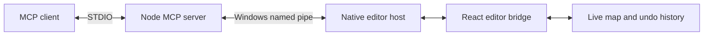

# Wulfram Forge MCP

A local Model Context Protocol (MCP) server for inspecting and editing maps in the Wulfram Forge Windows desktop editor.

An MCP client can work with the currently open, unsaved map: move mirrored structures, shape terrain, capture the editor view, validate placements, export a copy, and undo changes. Edits use the editor's existing undo history and require a current map revision.

## Features

| Tool | Purpose |
| --- | --- |
| `list_editor_sessions` | Discover MCP-enabled editor sessions. |
| `get_editor_state` | Read readiness, map name, revision, selection, and undo/redo counts. |
| `inspect_map` | Inspect dimensions, entities, and the active base layout. |
| `validate_map` | Check structure placement, power, slope, and base requirements. |
| `edit_entities` | Add, move, rotate, or remove structures in one atomic batch, optionally mirrored. |
| `edit_terrain` | Raise, lower, flatten, smooth, or texture a circular region, optionally mirrored. |
| `capture_view` | Capture the current editor view and interface as a PNG. |
| `undo` | Undo the most recent editor change. |
| `save_copy` | Save the requested revision as a new JSON file. |
| `export_map` | Export the requested revision as a new map ZIP. |

## Requirements

- Windows with Microsoft Edge WebView2.
- Node.js 22.13 or newer and npm; tested with Node.js 24.18.
- .NET 9 SDK to build the desktop editor.
- An MCP client supporting local STDIO servers, such as Codex.
- Network access for npm and NuGet dependency installation.

The MCP server depends on shared editor modules. Keep the source tree together; copying only `server.mjs` is insufficient.

## Repository and editor integration

This Git repository contains the MCP server files at its root: server.mjs, MCPserver.mjs, editor-client.mjs, package.json, the dependency lockfile, and the build, launch, and test scripts. It is not a standalone copy of the editor.

To use this repository, place its files directly in tools/mcp inside a compatible Wulfram Forge editor checkout. Do not leave them nested under tools/mcp/MapEditerMCP: the current imports and scripts resolve the editor root two directories above the server files. Alternatively, deliberately update all affected imports and script paths for a different layout.

The editor also needs the native host, React bridge, command module, integration call sites, test files, and assets shown below. These are included in the full developer handoff. Installing only this repository into an older editor does not add those components automatically.

The following tree shows the required integrated layout. The handoff uses a source folder; omit that prefix when the editor checkout itself is your repository root.

```text
source/
  tools/mcp/
    server.mjs            # Stable MCP entry point
    MCPserver.mjs         # Tool definitions and STDIO server
    editor-client.mjs     # Native session discovery and pipe client
    package.json
    package-lock.json
    launch-editor.ps1
    test-desktop.mjs
  lib/
    mcp-commands.ts        # Validated entity and terrain operations
    use-mcp-bridge.ts      # Live React state and undo integration
  desktop/WulframForge/
    McpEditorHost.cs       # Native bridge
    MainForm.cs           # Opt-in bridge startup
  components/editor/
    editor-app.tsx         # Editor integration
  tests/mcp.test.mjs
  Launch Forge MCP.cmd
```

Keep both `server.mjs` and `MCPserver.mjs`: the first imports the second. Preserve the capitalization when moving files between platforms.

## Install and build

Open PowerShell in the editor checkout, the directory containing the root `package.json`. For the handoff layout, first run `Set-Location source`.

Run each command only after the previous command succeeds:

```powershell
npm ci
npm ci --prefix tools/mcp

node node_modules/typescript/bin/tsc --noEmit
node --experimental-strip-types --test tests/mcp.test.mjs

node node_modules/vite/bin/vite.js build --config vite.desktop.config.ts
node tools/create-desktop-assets.mjs
dotnet publish desktop/WulframForge/WulframForge.csproj --configuration Release --runtime win-x64 --self-contained true --output dist/desktop/mcp-v0.1.0 /p:Version=0.7.0-mcp.1
```

These commands use an installed .NET SDK on `PATH`. The included `build-editor.ps1` convenience script instead expects a checkout-local `.dotnet-sdk/dotnet.exe`.

## Connect to Codex

From the editor checkout, register the server using absolute paths resolved on your machine:

```powershell
$forgeNode = (Get-Command node).Source
$forgeServer = (Resolve-Path tools/mcp/server.mjs).Path
codex mcp add wulfram-forge -- $forgeNode --experimental-strip-types $forgeServer
codex mcp get wulfram-forge
```

Launch `Launch Forge MCP.cmd`, then open or import a map. Reconnect MCP or restart the client to load the server's tools.

The launcher enables the native bridge and uses a separate persistent editor profile. Registering the MCP server does not launch the editor.

If you move the checkout, register it again using its new absolute path. If the client requires removing the old entry first, run `codex mcp remove wulfram-forge`, then repeat the registration command above.

## Example workflow

1. Call `list_editor_sessions` and select the intended session ID.
2. Call `inspect_map` to read its entity IDs and current revision.
3. Submit an edit using that session and revision.
4. Inspect the result or call `capture_view`.
5. Use the returned revision for the next edit, export, or undo.

For the included Three Lane Citadel fixture, this moves one base tower and its opposing counterpart:

```json
{
  "sessionId": "<session ID from discovery>",
  "expectedRevision": "<revision from inspection>",
  "edits": [
    {
      "operation": "move",
      "id": "team-1-base-tower-upper",
      "x": 1560,
      "mirror": true
    }
  ]
}
```

Coordinates are absolute world units; yaw is in radians. Entity IDs are map-specific. Mirroring requires a unique opposing partner.

## Editing behavior

- Each successful edit batch creates one normal undo step.
- Invalid batches reject without applying partial changes.
- New project-validation errors block edits; existing errors remain visible.
- Revisions change after manual edits, MCP edits, and undo. Stale requests reject.
- After a timeout or disconnect, inspect the map before retrying a write: the change may already have committed.
- Exports create new files under `outputs/mcp-exports` and never overwrite an existing file. Exporting a copy does not mark the editor saved.

## Architecture



The native pipe is restricted to the current Windows user and uses a random session credential. Session discovery returns editor information, not credentials. The bridge starts only when `WULFRAM_FORGE_MCP=1` and exposes named editor commands.

## Tests

Run the MCP tests from the editor checkout:

```powershell
node --experimental-strip-types --test tests/mcp.test.mjs
```

After building the MCP-enabled editor, run native acceptance:

```powershell
node --experimental-strip-types tools/mcp/test-desktop.mjs
```

The native test uses an isolated profile and the included Three Lane Citadel fixture under `outputs/three-lane-citadel-v1-final`. It checks discovery, paired editing, stale-revision rejection, screenshots, undo, invalid-placement rejection, terrain editing, and JSON/ZIP export parity.

The packaged snapshot passed six MCP tests, ten native acceptance steps, and TypeScript checks on the original development machine. Rerun them after integration or changes. Offline validation does not establish in-game behavior.

If publishing the handoff as a Git repository, retain the two test-fixture files: `project.json` and `Three-Lane-Citadel-v1.zip` in that fixture directory. The editor's `.gitignore` excludes `outputs/`, so those fixtures need an explicit exception or deliberate inclusion. Do not commit generated MCP exports, test profiles, session descriptors, or credentials.

## Troubleshooting

| Symptom | Check |
| --- | --- |
| `MODULE_NOT_FOUND` or connection closes during startup | Confirm the registered path exists, both server files are present, and both npm dependency installs completed. |
| No editor sessions | Start the MCP-enabled editor with the launcher; an ordinary editor launch does not enable the native host. |
| Stale revision | Inspect again and use the newly returned revision. |
| Edit rejected for power or placement | Read the reported validation errors and adjust the requested edit. |
| Export fails with `EEXIST` | Choose a new export name. |
| Native test cannot find its map | Restore the included fixture at the expected relative path. |

## Scope

This is a local Windows desktop integration. Browser-editor transport, camera-position controls, and remote hosting are not implemented. Screenshot capture uses the current view. The server does not add game-side minions, tower health, progression, or victory rules.

The handoff includes original editor/game assets needed for reproduction. Their inclusion does not grant additional redistribution rights; retain applicable notices when integrating or publishing.
